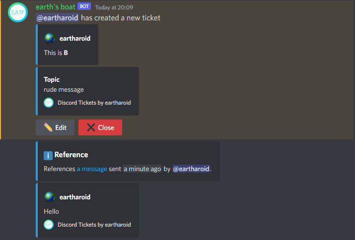

# Commands

!!! info "Symbols"
	:material-asterisk:{ .pink title="Required" } denotes a required option

	:material-headset:{ .orange title="Staff-only" } denotes a staff-only command or option

	:material-ticket:{ .blue title="Tickets-only" } denotes a command or option that can only be used within tickets

	:material-comment-text:{ .tip title="Autocompleted" } denotes a dynamic option that uses autocomplete


The command names, options, and choices on this page are in their original (English) form,
but you may see them translated in your Discord client.

## Context menu commands

### Messages

#### `Create a ticket from message`

Create a ticket with reference to the target message.
This can be used for reporting messages (and their senders).

??? example
	**Result:**

	

#### :material-ticket:{ .blue title="Tickets-only" } `Pin message`

Allows members that don't have manage messages permission to pin messages in their own tickets.
Pinned messages can be easily found later in archives.

### Users

#### :material-headset:{ .orange title="Staff-only" } `Create a ticket for user`

Send a prompt (in the channel the command is used in) for the target user to create a ticket by clicking a button.
If you have multiple [categories](./index.md#concept:categories) configured,
the staff member will be asked to select the category that the ticket will be created in.

This can be used as an alternative to repeatedly asking members to "please create a ticket with [`/new`](#new)".


## Chat (slash) commands

###  `/add`

Add a member to either a specific ticket or the ticket channel the command is used in.

#### Options

|                              Name                              |                            Description                            |    Example    |
| :------------------------------------------------------------: | :---------------------------------------------------------------: | :-----------: |
|     :material-asterisk:{ .pink title="Required" } `member`     |                  The member to add to the ticket                  | `@eartharoid` |
| :material-comment-text:{ .tip title="Autocompleted" } `ticket` | The ticket to add the member to (defaults to the current channel) |      N/A      |

??? example
	Add the mentioned member to the ticket that the command is used in:
	``` title="Example 1"
	/add member: @eartharoid
	```
	---
	Add the mentioned member to the specified ticket:
	``` title="Example 2"
	/add member: @eartharoid ticket: 91
	```

### :material-ticket:{ .blue title="Tickets-only" } `/claim`

Allows a staff member to take ownership of the ticket. All other staff members will be removed from the channel.
You can also [enable the claim button](../configuration/general.md#claim-button) on the ticket's opening message.

### :material-ticket:{ .blue title="Tickets-only" } `/close`

Send a request to close the ticket.
You can also [enable the close button](../configuration/general.md#claim-button) on the ticket's opening message.

When used by staff, the ticket creator must accept the request for the ticket to be closed.
When used by the ticket creator, a staff member must accept the request for the ticket to be closed.

Close requests can expire if [auto-closing](../configuration/general.md#auto-close) is enabled.

#### Options

|   Name   |            Description            | Example |
| :------: | :-------------------------------: | :-----: |
| `reason` | The reason for closing the ticket |   N/A   |

### :material-headset:{ .orange title="Staff-only" } `/force-close`

Allows staff to forcibly and instantly close one or more tickets.
Close requests are not sent, so the ticket creator is not prompted for feedback if enabled.
The `time` option can be any number of minutes, hours, days, or weeks - e.g. `5d` or `5 days`.

#### Options

|                               Name                               |                                          Description                                           | Example |
| :--------------------------------------------------------------: | :--------------------------------------------------------------------------------------------: | :-----: |
| :material-comment-text:{ .tip title="Autocompleted" } `category` |             Close all tickets in hte specified category (can be used with 'time')              |   N/A   |
|                             `reason`                             |                         The reason why the ticket(s) should be closed                          |   N/A   |
|  :material-comment-text:{ .tip title="Autocompleted" } `ticket`  |                                      The ticket to close                                       |   N/A   |
|                              `time`                              | Close all tickets that have been inactive for the specified time (can be used with 'category') |  `1w`   |

??? example
	Close the current ticket (the channel the command is used in) with a reason:
	``` title="Example 2"
	/force-close reason: The member is ignoring the close request
	---
	```
	Close all tickets in the "Support" category that have been inactive for more than 1 week:
	``` title="Example 1"
	/force-close category: Support time: 1w
	```

### `/help`

Show a clickable list of commands that the member has access to. Regular members are not shown staff-only commands.
When used by a staff members, additional information (the bot version) and some helpful links (such as to this website) are shown.

### :material-headset:{ .orange title="Staff-only" } `/move`

Move the current ticket to another category.

#### Options

|                           Name                           |            Description             | Example |
| :------------------------------------------------------: | :--------------------------------: | :-----: |
| :material-asterisk:{ .pink title="Required" } `category` | The category to move the ticket on |   N/A   |

### `/new`

Create a new ticket. If the guild has multiple categories configured, the member will be asked to select one.

#### Options

|                                Name                                |          Description          | Example |
| :----------------------------------------------------------------: | :---------------------------: | :-----: |
| :material-comment-text:{ .tip title="Autocompleted" } `references` | A related ticket to reference |   N/A   |


### :material-headset:{ .orange title="Staff-only" } :material-ticket:{ .blue title="Tickets-only" } `/priority`

Add an emoji before the channel name to declare the ticket's priority.

#### Options

|                           Name                           |       Description       |          Example           |
| :------------------------------------------------------: | :---------------------: | :------------------------: |
| :material-asterisk:{ .pink title="Required" } `priority` | The new ticket priority | [See choices](#priority_1) |

##### Choices

##### `priority`

- `🔴 High`
- `🟠 Medium`
- `🟢 Low`

### :material-ticket:{ .blue title="Tickets-only" }`/release`

Allows a staff member to release ownership of *(unclaim)* the ticket.

###  `/remove`

Remove a member from the ticket channel the command is used in.

#### Options

|                              Name                              |                              Description                               |    Example    |
| :------------------------------------------------------------: | :--------------------------------------------------------------------: | :-----------: |
|     :material-asterisk:{ .pink title="Required" } `member`     |                   The member to remove to the ticket                   | `@eartharoid` |
| :material-comment-text:{ .tip title="Autocompleted" } `ticket` | The ticket to remove the member from (defaults to the current channel) |      N/A      |

??? example
	Remove the mentioned member from the ticket that the command is used in:
	``` title="Example 1"
	/remove member: @eartharoid
	```
	---
	Remove the mentioned member from the specified ticket:
	``` title="Example 2"
	/remove member: @eartharoid ticket: 91
	```


### `/tag`

Send a tag to the current channel.

#### Options

|                        Name                         |         Description         |    Example    |
| :-------------------------------------------------: | :-------------------------: | :-----------: |
| :material-asterisk:{ .pink title="Required" } `tag` | The name of the tag to send |      N/A      |
|                        `for`                        | The member to mention/ping  | `@eartharoid` |

### `/tickets`

List your own or someone else's tickets.

#### Options

|                           Name                            |            Description            |    Example    |
| :-------------------------------------------------------: | :-------------------------------: | :-----------: |
| :material-headset:{ .orange title="Staff-only" } `member` | The member to list the tickets of | `@eartharoid` |

### :material-ticket:{ .blue title="Tickets-only" } `/topic`

Change the topic of a ticket. A modal form will be shown with the current topic as the default value.

### `/transcript`

Get the transcript of a ticket.
The default transcript template is a markdown file which contains information at the top, followed by all of the messages.
On desktop you can preview the file, but will need to download it if there are a lot of messages.

To optimise the experience for normal members, this command works in a slightly inconvenient way for staff members.

To get the transcript of another member's ticket, select the `/transcript` command,

1. Press ++arrow-right++ (right-arrow, or just click in the empty space) to escape the `ticket` option,
2. Select the `member`.
3. Click back in the `ticket` option field and start typing to search that member's tickets.

Note that the autocomplete response is cached by the app, so you will not see suggestions until you type.

#### Options

|                          Name                          |                    Description                    |    Example    |
| :----------------------------------------------------: | :-----------------------------------------------: | :-----------: |
| :material-asterisk:{ .pink title="Required" } `ticket` | The number of the ticket to get the transcript of |      N/A      |
|    :material-headset:{ .orange title="Staff-only" }    |                      member                       | `@eartharoid` |

### :material-ticket:{ .blue title="Tickets-only" } `/transfer`

Transfer the current ticket to another member.

#### Options

|                          Name                          |             Description              |    Example    |
| :----------------------------------------------------: | :----------------------------------: | :-----------: |
| :material-asterisk:{ .pink title="Required" } `member` | The member to transfer the ticket to | `@eartharoid` |

??? example
	Transfer the ticket to the mentioned member:
	``` title="Example"
	/transfer member: @eartharoid
	```
