# Features

!!! question "Switching from another bot?"
	See how Discord Tickets is different from other popular bots:

	[View comparisons :octicons-link-external-16:](https://blog.discordtickets.app/tag/comparison/){ target=_blank .md-button .md-button--primary }

## Concepts

[`Categories`](#concept:categories){ #concept:categories }
:   Tickets are organised into categories that you create (such as ban appeals, staff applications, billing support etc).

	Since v4, ticket and Discord categories are separate.
	Multiple ticket categories can belong to a single Discord channel category.

[`Panels`](#concept:panels){ #concept:panels }
:   Unlike some other bots, panels are not a central concept in Discord Tickets.
	Tickets belong to categories, and a panel is one of several ways you can create a ticket.

[`Staff`](#concept:staff){ #concept:staff }
:	A staff member is any member who has at least 1 role that is assigned to any ticket category within the guild.

## Ticket creation overview

```mermaid
flowchart TB
    A1(["➡️ /new command"]) ----> B
    A2(["➡️ Panel button/menu"]) ----> D
    A3(["➡️ Messsage:Create command"]) ---> B
    %% fa:fa-arrow-right-long
    A4(["➡️ User:Create command (staff)"]) -...->|"Staff interaction"| B
    A5(["➡️ DM (message is topic)"]) --> AA{Mulitple servers?}
    AA -->|Yes| AA1[/"❓ Select server with menu"/] ---> B
    AA -->|No| B
    B{Multiple categories?}
    B -->|Yes| B1[/"❓ Select category with menu"/] -.-> C
    B -.->|Yes| B1
    B -.->|No| C
    B1 --> D
    C[/"🕑 Target user clicks button"/] -->|Creator interaction| D
    B -->|No| D{"Satisfies required roles,\nlimits, etc?"}
    D ==>|Yes|E{Category has questions?}
    D-->|No|F(["❌ End with error"])
    E-->|Yes|G[/"❓ Questions modal"/]
    E-->|No|J
    E-->|No|H{Category requires topic?}
    H-->|Yes|I[/"❓ Topic modal\n(skipped if started with DM)"/]
    H-->|No|J
    G & I--> J(["✅ Create ticket"])
```

