# Features

<!--
!!! question "Switching from another bot?"
	**See how Discord Tickets is different from other popular bots:**

	[View comparisons :octicons-link-external-16:](https://blog.discordtickets.app/tag/comparison/){ target=_blank .md-button .md-button--primary
 -->
<!--

Switching from another bot? See how Discord Tickets is different from other popular bots:
<a href="https://blog.discordtickets.app/tag/comparison/" target="_blank">view comparisons.
<svg xmlns="http://www.w3.org/2000/svg" viewBox="0 0 16 16"><path fill-rule="evenodd" d="M10.604 1h4.146a.25.25 0 0 1 .25.25v4.146a.25.25 0 0 1-.427.177L13.03 4.03 9.28 7.78a.75.75 0 0 1-1.06-1.06l3.75-3.75-1.543-1.543A.25.25 0 0 1 10.604 1zM3.75 2A1.75 1.75 0 0 0 2 3.75v8.5c0 .966.784 1.75 1.75 1.75h8.5A1.75 1.75 0 0 0 14 12.25v-3.5a.75.75 0 0 0-1.5 0v3.5a.25.25 0 0 1-.25.25h-8.5a.25.25 0 0 1-.25-.25v-8.5a.25.25 0 0 1 .25-.25h3.5a.75.75 0 0 0 0-1.5h-3.5z"></path></svg>
</a>

 -->
## Concepts

[`Tickets`](#concept:tickets){ #concept:tickets }
:   A ticket is a channel where a member can have a private conversation with staff.

[`Categories`](#concept:categories){ #concept:categories }
:   Tickets are organised into categories that you create (such as ban appeals, staff applications, billing support etc).

	Since v4, ticket and Discord categories are separate.
	Multiple ticket categories can belong to a single Discord channel category.

[`Panels`](#concept:panels){ #concept:panels }
:   Unlike some other bots, panels are not a central concept in Discord Tickets.
	Tickets belong to categories, and a panel is one of several ways you can create a ticket.

[`Staff`](#concept:staff){ #concept:staff }
:	A staff member is any member who has at least 1 role that is assigned to any ticket category within the guild.

## Your data

Settings and data can be exported and imported through the Portal webapp.

## Ticket creation

There are 5 ways to create a ticket:

- Using the [`/new`](./commands.md#new) command
- From a [message context menu](./commands.md#create-a-ticket-from-message)
- From a prompt sent by staff with a [user context menu](./commands.md#create-a-ticket-for-user)
- Using a button or select-menu on a panel
- Sending a direct message.

This flowchart shows the different pathways that can be taken to create a ticket:

```mermaid
flowchart TB
    A1(["➡️ /new command"]) ----> B
    A2(["➡️ Panel button/menu"]) ----> D
    A3(["➡️ Message:Create command"]) ---> B
    %% fa:fa-arrow-right-long
    A4(["➡️ User:Create command (staff)"]) -...->|"Staff interaction"| B
    A5(["➡️ DM (message is topic)"]) --> AA{Multiple servers?}
    AA -->|Yes| AA1[/"❓ Select server with menu"/] ---> B
    AA -->|No| B
    B{Multiple categories?}
    B -->|Yes| B1[/"❓ Select category with menu"/] -.-> C
    B -.->|Yes| B1
    B -.->|No| C
    B1 --> D
    C[/"🕑 Target user clicks button"/] -->|Creator interaction| D
    B -->|No| D{"Satisfies required roles,<br/>limits, etc?"}
    D ==>|Yes|E{Category has questions?}
    D-->|No|F(["❌ End with error"])
    E-->|Yes|G[/"❓ Questions modal"/]
    E-->|No|H{Category requires topic?}
    H-->|Yes|I[/"❓ Topic modal<br/>(skipped if started with DM)"/]
    H-->|No|J
    G & I--> J(["✅ Create ticket"])
```

 

 This page is still being worked on!
<!--
## Archives

## Questions

## Tags

## Automation

## Context

## Settings
-->