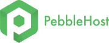

# Installation guides

!!! pebble ""
	

		
[{ .no-glightbox }](https://pebble.host/discordtickets)

		

		**Discord Tickets is partnered with [PebbleHost](https://pebble.host/discordtickets) to give you affordable hosting.**
		Click on the logo to use the affiliate link to support me at no extra cost to you.
		

	

	
Discord Tickets can be hosted either on a dedicated/virtualised machine or shared hosting. 

| :fontawesome-brands-docker: Docker { .docker .text-lg } | :fontawesome-brands-linux: Standalone { .linux .text-lg } | :fontawesome-solid-train: Railway { .railway .text-lg } | :fontawesome-solid-crow: Pterodactyl { .pterodactyl .text-lg } | :fontawesome-solid-cube: PebbleHost { .pebblehost .text-lg } |
| :--------------------------------------------------------: | :----------------------------------------------------------: | :--------------------------------------------------------: | :---------------------------------------------------------------: | :-------------------------------------------------------------: |
|                 Docker experience required                 |                  Linux experience required                   |               Docker experience recommended                |                  Node.js experience recommended                   |                 Node.js experience recommended                  |
|                       Most difficult                       |                     Moderately difficult                     |                            Easy                            |                              Easier                               |                             Easiest                             |
|                  :octicons-clock-24: 10m                   |                   :octicons-clock-24: 10m                    |                   :octicons-clock-24: 5m                   |                      :octicons-clock-24: 5m                       |                     :octicons-clock-24: 5m                      |
|     [Start](docker.md){.md-button .md-button--primary}     |    [Start](standalone.md){.md-button .md-button--primary}    |    [Start](railway.md){.md-button .md-button--primary}     |      [Start](pterodactyl.md){.md-button .md-button--primary}      |    [Start](pebblehost.md){ .md-button .md-button--primary }     |

## Hosting providers

If you don't already have a hosting provider, please consider using one of these affiliate links to buy hosting.
Buying with an affiliate link supports me at no extra cost to you.

### Shared
[{ .no-glightbox }](https://pebble.host/discordtickets)

 

### Dedicated/virtual machines
Get €20 account credit:

[{ .no-glightbox }](https://lnk.earth/hetzner)

